# Database system summary

##  Different design for data model

### Hierarchical structure

Records' relationships form a treelike model, which is simple but inflexible because the relationship is confined to a one-to-many relaitonship.

The main drawback of hierarchical structure is :

1. Information is repeated.
2. Existence depends on parents.
3. Record-at-a-time access DML

### Network structure

Networks are more flexible than hierarchies but more complex.

Loading and recovering networks is more complex than hierarchies

### Relational

设计理念:

1. Store the data in a simple data structure (Table)
2. Access it through a high level set-at-a-time DML
3. No need for a physical storage proposal

进一步产生了 -> Entity-relationship (ER) data model

Statements:

A data base be thought of a collection of instances of entities. In addition, entities have attributes, which are the data elements that characterize the entity. One or more of there atrributes would be designated to be unique (key). Lastly, there could be relationships between the entities. Relationships could be 1-to-1, 1-to-n, n-to-1 or m-to-n, depending on how the entities participate in the relationship.

## Concepts

A data model is collection of concepts for describing the data in a database

A schema is a description of a particular collection of data, using a given data model

## Data model

Relational

NoSQL:

​	Key/Value

​	Graph

​	Column-family

## Relational model

Primary key: Uniquely identifies a single tuple

Auto-generation of unique integer:

MySQL -> AUTO-INCREMENT

Foreign key: specifies that an attribute from one relation has to map to a tuple in another relation

## Relational algebra

Operators: 


Each operator takes one or more relations as inputs and outputs a new relation

### Select

Choose a subset of tuples from a relation that satisfies a selection predicate.

-> Predicate acts as a filter to retain only tuples that fullfill it qualifying requirement.

-> Can combine multiple predicates using conjunction / disjunction

### Projection

Generate a relation with tuples that contains only the specified attributes. 

-> Can rearrange attributes' ordering

-> Can manipulate the value

### Union 

Generate a relation that contains all tuples that appear in either only one or both input relation. 

Intersection similar

### Different

Generation a relation that contains only the tuples that appear in the first and not the second of the input relations

### Product (Cross Join)

Generate a relation that contains all possible combinations of tuples from the input relations.

### Join

Generate a relation that cantains all tuples that are a combination of two tuples, with a common values for one or more attributes.

### Extra operatiors

Rename, Assignment, Duplicate Elimination, Aggregation, Sorting, Division

## SQL

Relational algebra defines the high-level steps of how to compute a query


A better approach is to state the high-lelve answer that you want the DBMS to compute. SQL is the de facto standard

Including :
Data Manipulation Language (DML)

Data Definition Language (DDL)

Data Control Language (DCL)

View definition

Integrity & Referential constrains

Transaction

**Important**: SQL is based on bags(duplicates) not sets(no duplicates)

### Example Database

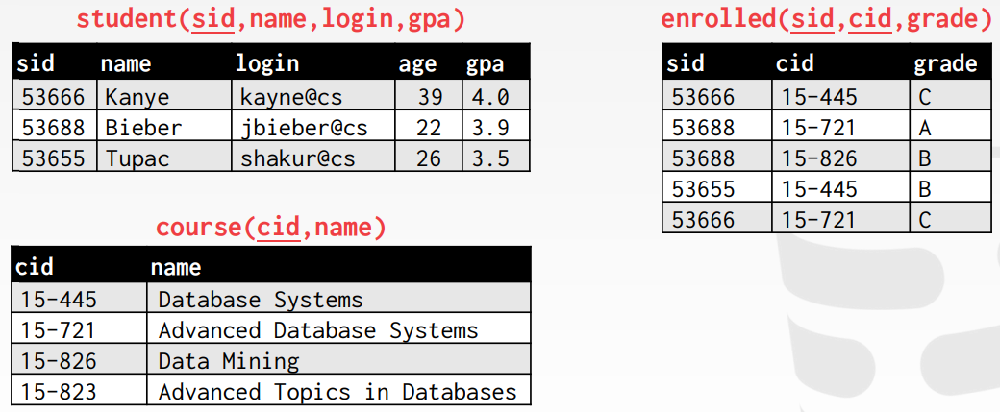

### Aggregates

Functions that return a single value from a bag of tuples

Aggregate functions can only be used in the SELECT output list

```SQL
SELECT COUNT(login) AS cnt FROM student WHERE login LIKE '%@cs'
```

COUNT, SUM, AVG support DISTINCT

Output of other columns outside of an aggregate is undefined

### Group By

Project tuples into subsets and calculate aggregates against each subset.

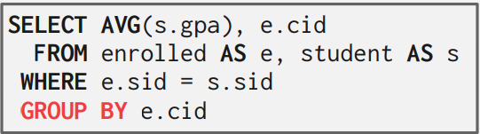

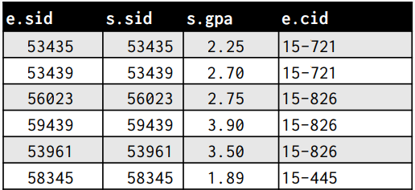

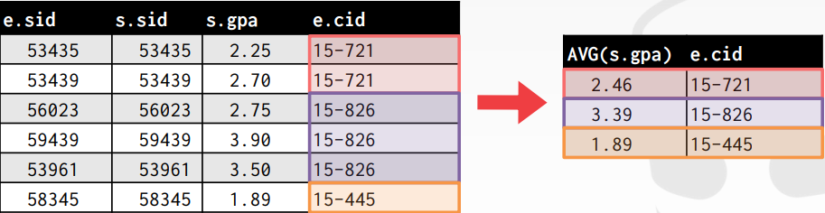

Non-aggregated values in SELECT output clause must appear in GROUP BY clause.


### Having

Filter results based on aggregation computation. Like a WHERE clause for a GROUP BY


上面这个SQL语句是错误的，因为SQL的执行顺序是

$FROM \rightarrow WHERE \rightarrow GROUP \ BY \rightarrow AGGREGATION \rightarrow HAVING$

所以当WHERE clause执行时，并不知道avg_gpa的值。这是就要用到having 语句， 当aggregation根据group by执行完后，使用Having进行filtering 操作。


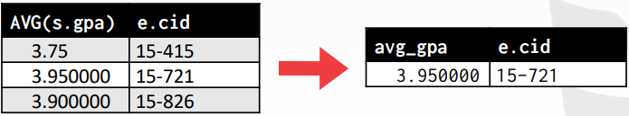

### String operations

**Like** is used for string matching

'%' Matches any substring(including empty strings)

'_' Match any one character

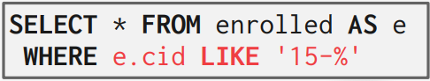

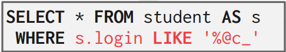


'||' : concatenate two or more strings togather

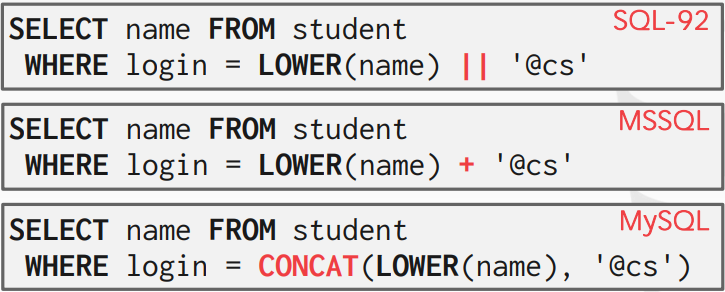

### Output Redirection

Store query results in another table, table will have the same number of columns with the same types as the input


### Output control

```SQL
ORDERED BY <column*> [ASC|DESC]
```

Order the output tuples by the values in one or more of their columns

```sql
LIMIT <count> [OFFSET]
```

-> Limit the number of tuples returned in output

-> Can set an offset to return a "range"

### Nested queries

Queries containing other queries. They are often difficult to optimize.

Inner queries can appear (almost) angwhere in query

ALL -> Must satisfy expression for all rows in subquery

ANY-> Must satisfy expression for at least one row in sub-query

IN -> Equivalent to '=ANY()'

EXISTS -> At least one row is returned.

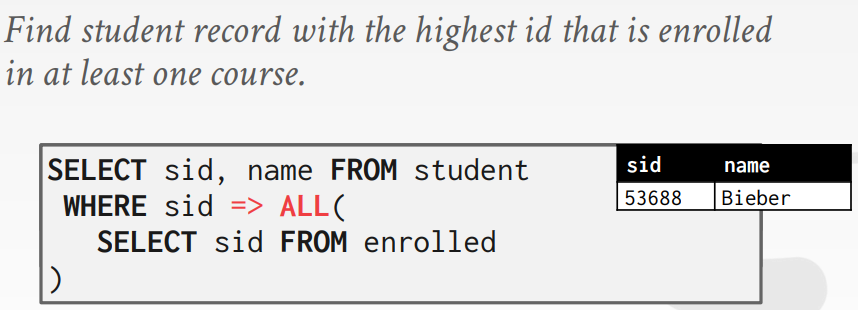

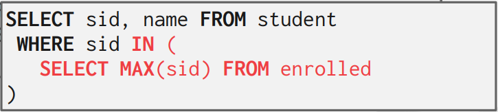

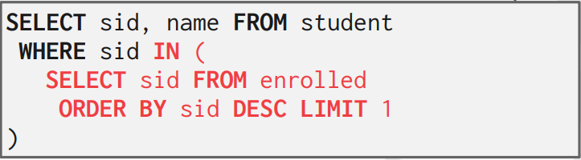

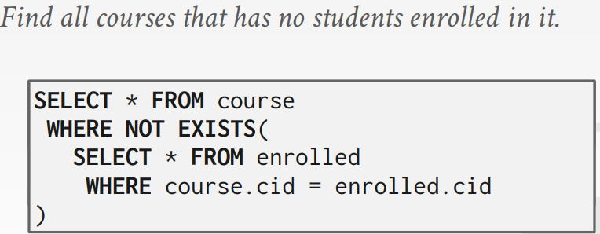

### Window functions

Performs a "sliding" calculation across a set of tuples that are related.


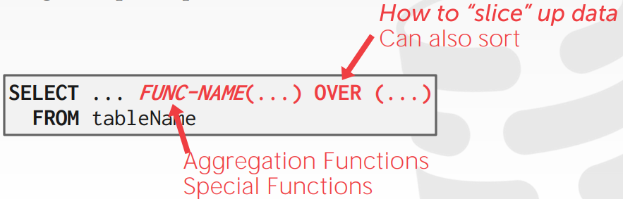

Aggregation functions:

Special window functions:
-> ROW_NUMBER() -> number of the current row

-> Rank() -> Order position of the current row

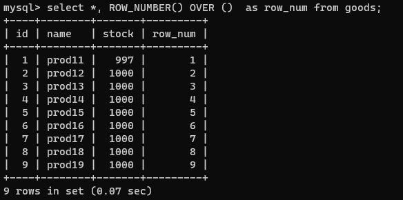

The **OVER** keyword specifies how to group together tuples when computing the window function.

Use **Partition by** to specify group.

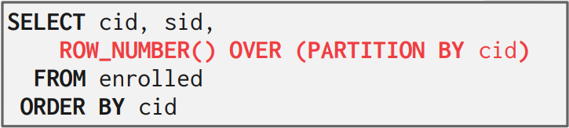

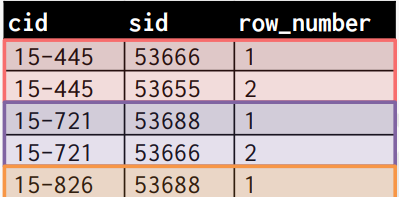

You can also include an **ORDER BY** in the window grouping to sort entries in each group

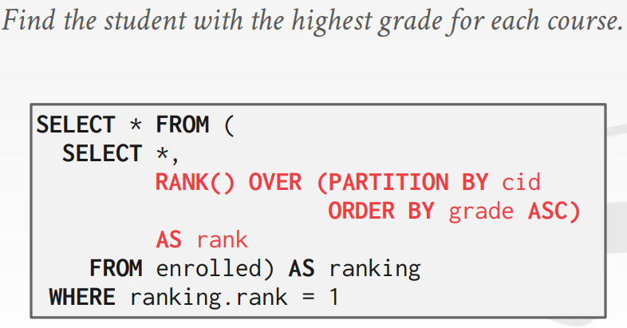

Group tuples by cid then sort by grade

### COMMON TABLE EXPRESSIONS

Provides a way to write auxiliary statements for use in a larger query

-> Think of it like a temp table just for one query

Alternative to nested queries and views.


You can bind output columns to names before the AS keyword

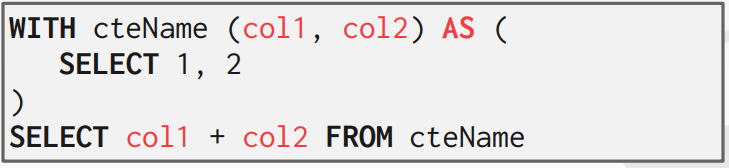

## Storage

### Access Time

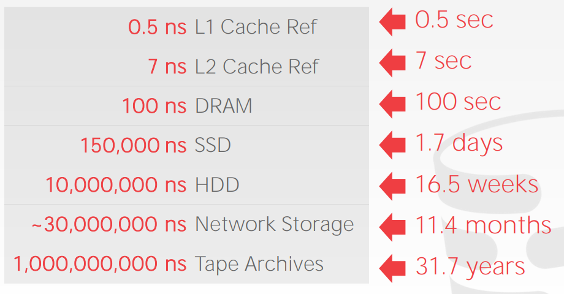

### 为什么不借助操作系统

One can use memory mapping(mmap) to store the contents of a file into a process' address space.

The OS is responsible for moving data for moving the files' pages in and out of memory.

DBMS (almost) always want to control things itself and can do a better job at it.

-> Flushing dirty pages to disk in the correct order

-> Specialized prefetching

-> Buffer replacement policy

-> Thread/process scheduling

### File storage

The DBMS stores a database as one or more files on disk. The os doesn't know anything about the contents of these files.

#### Storage manager

The storage manager is responsible for maintaining a database's files. Some do their own scheduling for reads and writes to improve spatial and temporal locality of pages.

It organizes the files as a collection of *pages*.

-> Track data read/written to pages.

-> Track the available space

A page is a fixed-size block of data.

-> It can contain tuples, meta-data, indexes, log records..

-> Most systems do not mix page types

-> Some systems require a page to be self-contained.

Each page is given a unique identifier.

-> The DBMS uses an indirection layer to map page ids to physical locations.

Different DBMSs manage pages in files on disk in different ways

-> Heap file organization

-> Sequential/ Sorted File Organization

-> Hashing File Organization

#### DATABASE HEAP

A heap file is an unordered collection of pages .

Need meta-data to keep track of what pages exist and which ones have free space.

Two ways to represent a heap file:

-> LinkedList

-> Page directory

#### Linked list

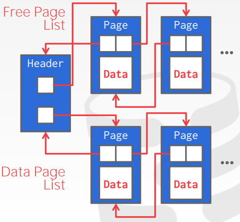

Maintain a header page at the begining of the file that stores two pointers:

-> HEAD of the free page list

-> HEAD of the data page list

Each page keeps track of the number of free slots in itselt

#### Page directory

The DBMS maintains special pages that tracks the location of data pages in the database files.

The directory also records the number of free slots per page

The DBMS has to make sure that the directory pages are in sync with data pages.

#### Page Header

Every page contains a header of meta-data about the page's contents.

-> Page size

-> Checksum

-> DBMS Version

-> Transaction Visibility

-> Compression information

### Page Layout

So how to organize the data stored inside of the page?

Two approaches:

1. Tuple-oriented
2. Log-structured

#### Slotted Pages

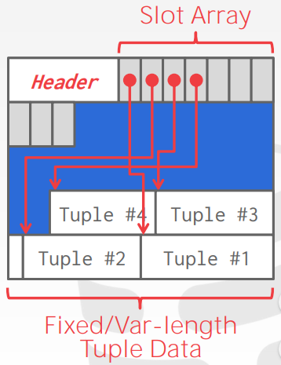

The Slot Array maps "slots" to the tuples' starting position offsets.

The header keeps track of:

1. The number of used slots
2. The offset of the starting location of the last slot used.

#### Log-structed file organization

Instead of storing tuples in pages, the DBMS only sotres log records.

The system appends log records to the file of how the database was modified.

-> Inserts store the entire tuple

-> Deletes mark the tuple as deleted

-> Updates contain the delta of just the attributes that were modified.

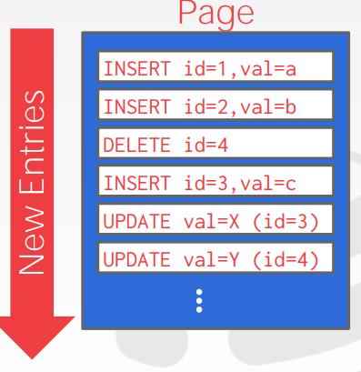

To read a record, The DBMS scans the log backwards and "recreates" the tuple to find what it needs.

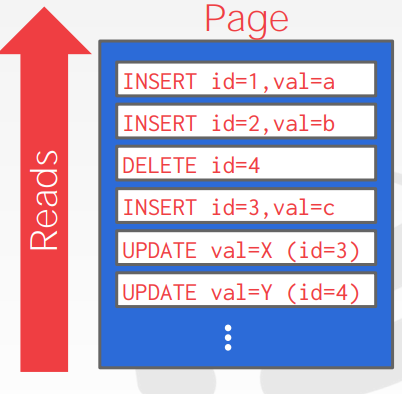

Build indexes to allow it to jump to locations in the log

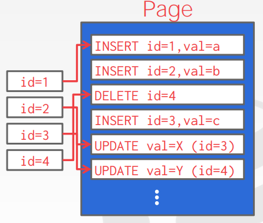

Periodically compact the log

### Tuple Layout

A tuple is essentially a sequence of bytes. It is the job of DBMS to interpret those bytes into attributes types and values.

#### Tuple header

Each tuple is prefixed with a header that contains meta-data about it.

-> Visibility info(Concurrency control)

-> Bit Map for NULL values

#### Record IDs

The DBMS needs a way to keep track of individual tuples. Each tuple is assigned a unique record identifier.

-> Most common: page_id + offset/slot

-> Can also contain file location info

### System catalog

A DBMS stores meta-data about databases in its internal catalogs

-> Tables, Columns, indexes, views

-> Users, Permissions

-> Internal statistics

Accessing table schema: 

```MYSQL
DESCRIBE student; 
```

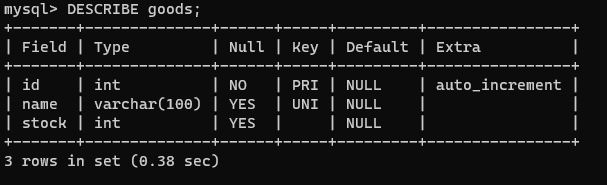

### OLTP: On-line transaction processing

Simple queries that read/update a small amount of data that is related to a single entity in the database.

### OLAP: On-Line Analytical Processing

Complex queries that read large portions of the database spanning multiple entities.
